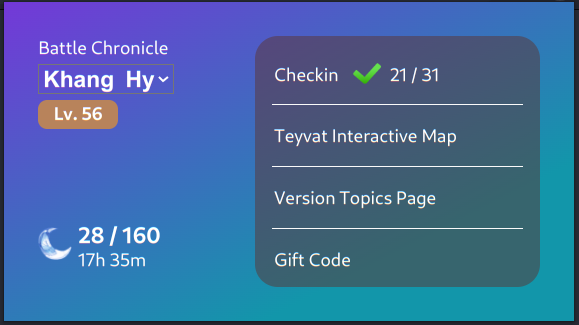

# Next.js Chrome Extension Genshin Impact Sync  🚀  

Next.js Chrome Extension Genshin Impact Sync is a Chrome extension using Next.js.

## Table of Contents ✨  

- [Description](#description)
- [Installation](#installation)
- [Usage](#usage)

# Description
This is a quick and convenient tool to track personal accounts of Genshin Impact users. I do not collect any user information. I just use the official API from Hoyolab.

There are 5 main functions:
- Monitor the amount of resin stored
- Track daily checkin status in game and checkin page shortcut
- Shortcut to Genshin Impact's map view page
- Shortcut to Genshin Impact event page
- Shortcut to Genshin Impact's gift code entry page



# Installation

To install and run Next.js Chrome Extension Starter locally, follow these steps:

1. Clone this repository: 

   ```bash
   git clone https://github.com/khanghy3004/next-chrome-extension-genshin-impact-sync.git
   ```
2. Navigate to project directory: 

   ```
   cd next-chrome-extension-genshin-impact-sync
   ```
3. Install the dependencies using npm: 
   ```
   npm install
   ```

# Usage
## Usage Locally  🔥
To run the Next.js Chrome Extension Starter locally, follow these steps:

Run the project:
```
npm run dev
```
`This will run project on your localhost`

 http://localhost:3000/

## Build and Import To Chrome 🔥
To build and import Next.js Chrome Extension Starter to chrome browser, follow these steps:

1. Build the project:
```
npm run build
```
`This will run prep and export to create new folder 'out/', and rename '_next' forlder to 'next' (without underscore)`

2. Open Google Chrome and go to chrome://extensions.


3. Enable the "Developer mode" toggle switch.

4. Click on "Load unpacked" and select the out folder generated by the build process.

5. The Next.js Chrome Extension Starter should now be loaded as an unpacked extension in Google Chrome.


